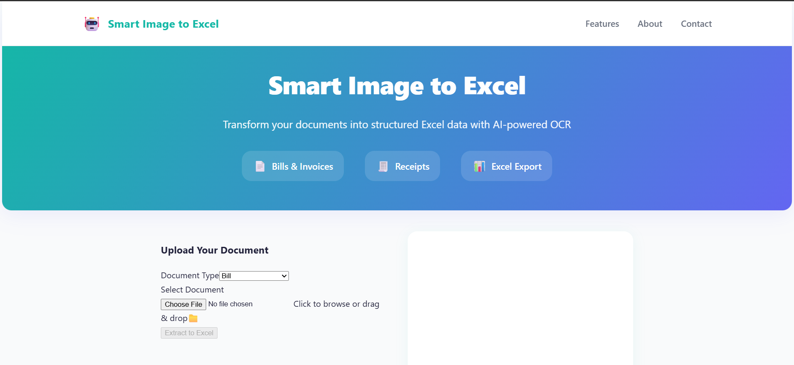

# Smart Image to Excel

Transform your documents into structured Excel data with AI-powered OCR technology. Upload bills, invoices, receipts, or any document and get organized data ready for analysis.



##  Features

- **AI-Powered OCR**: Advanced text extraction from images and PDFs
- **Multiple Document Types**: Support for bills, invoices, receipts, and generic documents
- **Excel Export**: Direct export to Excel format with structured data
- **Real-time Preview**: See your document before processing
- **Modern UI**: Clean, responsive design with intuitive user experience
- **Fast Processing**: Quick document analysis and data extraction

##  Quick Start

### Prerequisites

- Python 3.8 or higher
- Node.js 16 or higher
- npm or yarn

### Installation

1. **Clone the repository**
   ```bash
   git clone <repository-url>
   cd smart-image-to-excel
   ```

2. **Set up the Backend**
   ```bash
   cd backend
   python -m venv venv
   
   # On Windows
   venv\Scripts\activate
   
   # On macOS/Linux
   source venv/bin/activate
   
   pip install -r requirements.txt
   ```

3. **Set up the Frontend**
   ```bash
   cd ../Frontend
   npm install
   ```

### Running the Application

1. **Start the Backend Server**
   ```bash
   cd backend
   python main.py
   ```
   The backend will run on `http://localhost:8000`

2. **Start the Frontend Development Server**
   ```bash
   cd Frontend
   npm run dev
   ```
   The frontend will run on `http://localhost:5173`

3. **Open your browser** and navigate to `http://localhost:5173`

##  Usage

1. **Upload Document**: Click "Upload Your Document" and select an image or PDF file
2. **Select Document Type**: Choose the appropriate document type (Bill, Invoice, Receipt, or Generic)
3. **Process**: Click "Extract to Excel" to start the AI processing
4. **Review Results**: View the extracted data in structured format or raw text
5. **Export**: Click "Download Excel File" to export the data to Excel

## 🛠 Technology Stack

### Backend
- **Python**: Core application logic
- **FastAPI**: Modern web framework for API development
- **OpenCV**: Image processing and OCR
- **Pandas**: Data manipulation and Excel export
- **Pillow**: Image handling

### Frontend
- **React**: Modern UI framework
- **Vite**: Fast build tool and development server
- **Tailwind CSS**: Utility-first CSS framework
- **Axios**: HTTP client for API communication

##  Backend Architecture

### API Endpoints

The backend provides two main endpoints:

1. **`POST /extract/`** - Document Processing
   - Accepts file upload and document type
   - Returns structured data and raw text
   - Supports images and PDFs

2. **`POST /export/`** - Excel Export
   - Converts structured data to Excel format
   - Returns downloadable Excel file

### OCR Processing

- **Tesseract OCR**: Extracts text from images and PDFs
- **PDF2Image**: Converts PDF pages to images for OCR processing
- **Pillow**: Image handling and preprocessing

### AI Integration

- **Google Gemini AI**: Processes extracted text to structure data
- **Document Type Templates**: Specialized prompts for bills, invoices, receipts
- **JSON Response Parsing**: Safe parsing of AI-generated structured data

### Key Features

- **Multi-format Support**: Handles images (PNG, JPG, etc.) and PDFs
- **Error Handling**: Comprehensive error handling and validation
- **CORS Support**: Configured for frontend integration
- **Environment Variables**: Secure API key management

##  Project Structure

```
smart-image-to-excel/
├── backend/
│   ├── main.py              # FastAPI server with API endpoints
│   ├── ocr_script.py        # OCR processing logic
│   └── venv/                # Python virtual environment
├── Frontend/
│   ├── src/
│   │   ├── components/      # React components
│   │   ├── services/        # API services
│   │   └── App.jsx          # Main application
│   ├── package.json         # Node.js dependencies
│   └── README.md           # Frontend documentation
└── README.md               # This file
```

##  Configuration

### Backend Configuration

The backend uses environment variables for configuration. Create a `.env` file in the backend directory:

```env
# Server Configuration
HOST=0.0.0.0
PORT=8000
DEBUG=True

# AI Configuration
GEMINI_API_KEY=your_gemini_api_key_here

# CORS Settings
ALLOWED_ORIGINS=http://localhost:5173,http://localhost:3000
```

### Frontend Configuration

The frontend API endpoint can be configured in `src/services/api.js`:

```javascript
const API_BASE_URL = 'http://localhost:8000';
```

##  Deployment

### Backend Deployment

1. **Using Docker** (recommended):
   ```bash
   cd backend
   docker build -t smart-image-to-excel-backend .
   docker run -p 8000:8000 smart-image-to-excel-backend
   ```

2. **Using Python directly**:
   ```bash
   cd backend
   pip install -r requirements.txt
   python main.py
   ```

### Frontend Deployment

1. **Build for production**:
   ```bash
   cd Frontend
   npm run build
   ```

2. **Deploy to static hosting** (Netlify, Vercel, etc.):
   ```bash
   # The build output will be in the dist/ directory
   # Upload the contents to your hosting provider
   ```

##  Contributing

1. Fork the repository
2. Create a feature branch (`git checkout -b feature/amazing-feature`)
3. Commit your changes (`git commit -m 'Add some amazing feature'`)
4. Push to the branch (`git push origin feature/amazing-feature`)
5. Open a Pull Request

##  License

This project is licensed under the MIT License - see the [LICENSE](LICENSE) file for details.

## 🙏 Acknowledgments

- Built with modern web technologies
- Powered by AI and OCR technology
- Designed for productivity and ease of use

##  Support

If you encounter any issues or have questions:

1. Check the [Issues](https://github.com/your-repo/issues) page
2. Create a new issue with detailed information
3. Contact the development team

---

**Smart Image to Excel** - Making document processing smarter and faster! 🚀 
